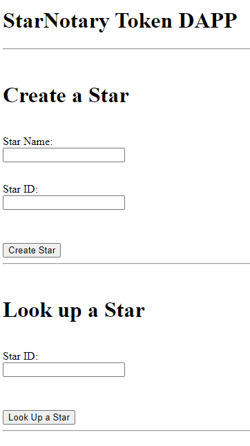

# Star Notary

**Program**: Blockchain Developer Nanodegree Program

**Project**: Star Notary

**Date**: 19th of May 2021

---

ERC-721 Token Name: `StarToken`

ERC-721 Token Symbol: `STR`

Token Address on Rinkeby Network: `0xcb4440Bc777cc0B7afE35e3524c691b69cc9dBbb` @ [Etherscan](https://rinkeby.etherscan.io/address/0xcb4440bc777cc0b7afe35e3524c691b69cc9dbbb)

---

Truffle Version: `v.5.2.0`

OpenZeppelin: `2.3.0`

----

App Screenshot:

